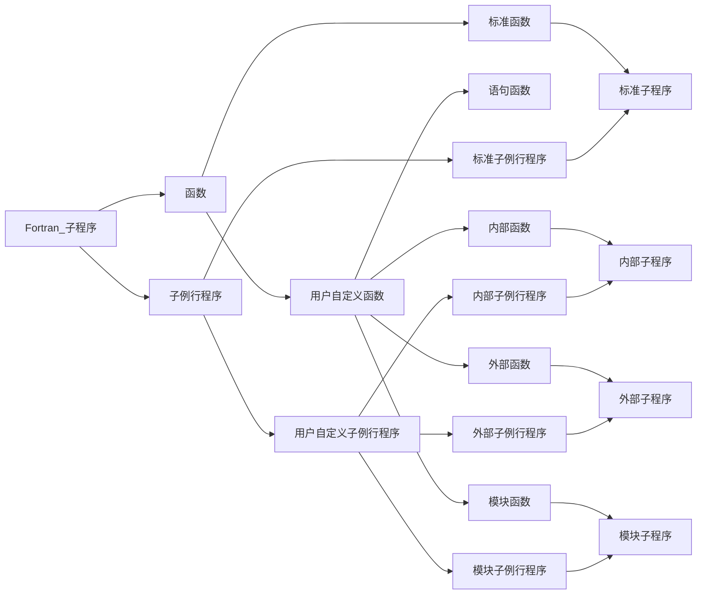

# 函数与子例行程序

函数是指产生一个运算结构并与函数名称相关联的通过操作数调用执行的子程序；

子例行程序是指完成数据处理并产生多个处理结果且通过 CALL 语句调用执行的子程序。

## 标准子程序

标准子程序求解生活中比较常见的问题。

### 标准函数

Fortran 提供的标准函数种类非常多，常见的有：

（1）三角函数

| Fortran    | 意义           | 输入型       | 输出型 |
| ---------- | -------------- | ------------ | ------ |
| `SIN(x)`   | 求正弦三角函数 | 实型（弧度） | 实型   |
| `SIND(x)`  | 求正弦三角函数 | 实型（角度） | 实型   |
| `COS(x)`   | 求余弦三角函数 | 实型（弧度） | 实型   |
| `COSD(x)`  | 求余弦三角函数 | 实型（角度） | 实型   |
| `TAN(x)`   | 求正切三角函数 | 实型（弧度） | 实型   |
| `TAND(x)`  | 求正切三角函数 | 实型（角度） | 实型   |
| `COTAN(x)` | 求余切三角函数 | 实型（弧度） | 实型   |

（2）数值计算函数

这部分的意义和输入输出类型是显然的。

| Fortran             | 意义 | 输入型 | 输出型 |
| ------------------- | ---- | ------ | ------ |
| `ABS(x)`            |      |        |        |
| `INT(X)`            |      |        |        |
| `NINT(X)`           |      |        |        |
| `MAX(x1,x2,...,xn)` |      |        |        |
| `MIN(x1,x2,...,xn)` |      |        |        |
| `MOD(m,n)`          |      |        |        |
| `EXP(X)`            |      |        |        |
| `LOG(X)`            |      |        |        |
| `LOG10(x)`          |      |        |        |
| `SQRT(x)`           |      |        |        |

（3）类型转换函数

将数值型数据转换成其他类型的数值型数据，意义和输入输出是显然的。

| Fortran     | 意义 | 输入型 | 输出型 |
| ----------- | ---- | ------ | ------ |
| `REAL(x)`   |      |        |        |
| `FLOAT(x)`  |      |        |        |
| `INT(x)`    |      |        |        |
| `DOUBLE(x)` |      |        |        |
| `CMPLX(x)`  |      |        |        |

（4）类型查询函数

| Fortran        | 意义               | 输入型 | 输出型 |
| -------------- | ------------------ | ------ | ------ |
| `DIGITS(x)`    | 查询数值二进制位数 |        |        |
| `EPSILON(x)`   | 查询最小正实数     |        |        |
| `HUGE(x)`      | 查询最大值         |        |        |
| `KIND(x)`      | 查询 KIND 值       |        |        |
| `PRECISION(x)` | 查询有效位数       |        |        |
| `SIZEOF(x)`    | 查询存储字节数     |        |        |

（5）随机数生成函数

| Fortran  | 意义       | 输入型       | 输出型 |
| -------- | ---------- | ------------ | ------ |
| `RAN(x)` | 生成随机数 | 整型，KIND=4 |        |

（6）日期和时间处理函数

| Fortran                                | 意义         | 输入型       | 输出型 |
| -------------------------------------- | ------------ | ------------ | ------ |
| `SETDAT(year,month,day)`               | 修改系统日期 | 整型，KIND=2 | 逻辑型 |
| `SETTIM(hour,minuts,second,hundredth)` | 修改系统时间 | 整型，KIND=2 | 逻辑型 |

设置成功，则返回 `.TRUE.`；否，则返回 `.FALSE.`。

（7）字符串处理函数

| Fortran                   | 意义                         | 输入型             | 输出型 |
| ------------------------- | ---------------------------- | ------------------ | ------ |
| `ACHAR(i)`                | ASCII 码转字符               | 整型，$0 \sim 255$ |        |
| `CHAR(i)`                 | ASCII 码转字符               | 整型，$0 \sim 255$ |        |
| `INDEX(string,substring)` | 求子串位置                   | 字符型             | 整型   |
| `LEN(string)`             | 求子串长度                   | 字符型             | 整型   |
| `LEN_TRIM(string)`        | 求子串长度，但是不计末尾空格 | 字符型             | 整型   |
| `TRIM(string)`            | 去掉末尾空格                 | 字符型             | 字符型 |

（8）地址计算函数

| Fortran  | 意义                     | 输入型 | 输出型 |
| -------- | ------------------------ | ------ | ------ |
| `LOC(x)` | 获取数据存储空间起始地址 |        |        |

（9）位运算

| Fortran        | 意义               | 输入型 | 输出型 |
| -------------- | ------------------ | ------ | ------ |
| `BIT_SIZE(i)`  | 求整数的二进制位数 | 整型   |        |
| `BTEST(i,pos)` | 测试整数的某一位   | 整型   |        |
| `IAND(i,j)`    | 按位与运算         | 整型   |        |
| `IOR(i,j)`     | 按位或运算         | 整型   |        |
| `NOT(i)`       | 按位取反运算       | 整型   |        |

Fortran 95 涵盖的标准函数详细见 [FORTRAN 95 标准函数简表](FORTRAN 95 标准函数简表.md)

**标准函数的调用**

标准函数可作为表达式中的操作数进行调用，其返回的函数值作为操作数参与表达式运算。

在使用标准函数时，应注意如下几点：

1. 每个标准函数对变元的个数和类型有明确的要求。
2. 每个标准函数的值只有一个，且有明确的类型规定。绝大多数的标准函数的函数类型与变元类型相同，但也有个别不同。
3. 注意三角函数的不同单位。
4. 标准函数的变元必须写在函数后的括号内，变元可以是常量、变量和表达式，个别函数的变元只能是变量。
5. IMPLICIT 语句不能改变一个标准函数的类型。
6. 标准函数可以用 INTRINSIC 语句声明，也可以不声明。

### 标准子例行程序

标准子例行程序又称为系统子例行程序，用于程序控制、文件管理、随机数生成、日期处理、键盘处理、错误处理、参数查询、存储分配和数组处理等。

