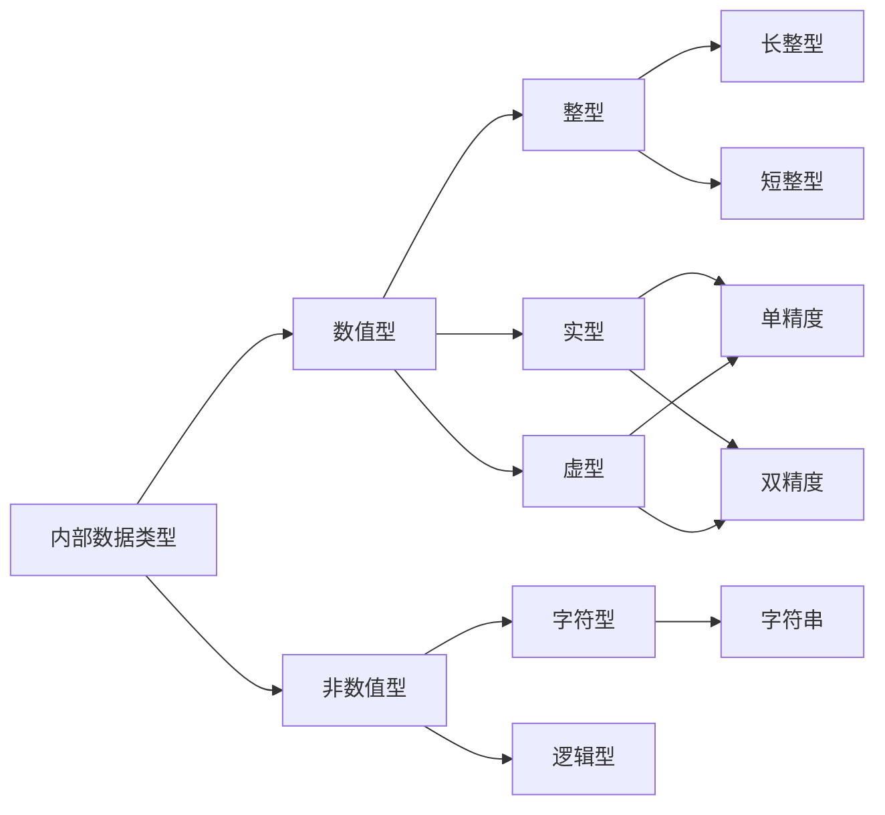

# 基本数据类型

**数据**是自然界中客观事物的符号表示。表达在程序之内，能够进行处理的数据称为**数据对象**。**数据类型**是数据的形式化和抽象化说明，说明一类数据的共同特性，而不是具体的数据对象。**子数据对象**是数据对象的一部分，如数组元素是数组对象的子对象，子串是字符串对象的子对象。

在计算机中，不同的数据类型有不同的**名称**、**表示方法**、**运算方式**、**存储方式**和**取值范围**。

Fortran 95 具有丰富的数据类型，如内部数据类型、派生数据类型、数组类型、指针类型、公用区类型等。

其中 5 种内部数据有着这样的划分，每种数据都能通过修改 `kind` 值参数确定数据的存储开销、精度、范围，对数据类型进行细化。



## 常量和变量

**常量**是直接写在程序中且 程序运行期间保持不变的数据，在程序中直接生成并用于计算和处理。

**变量**是在程序运行中可随时改变的数据。每个变量需要一个符合名称规定的唯一合法名称，即**变量名**。在内存中每个变量分配若干个连续的存储单元来存放变量的值，变量名代表该变量存储单元的首地址。

变量名的长度为 31 个字符，超过的部分被舍弃。

在使用变量前，需要通过类型声明语句来定义变量。

（1）变量的显式声明

在可执行语句前通过类型声明语句对变量类型进行声明。

（2）变量的隐式声明

Fortran 95 存在 **I-N 规则**，在给变量取名的同时对变量类型完成声明。

I-N 规则规定：变量名以字母 `I J K L M N i j k l m n` 为开头的变量默认为整型变量，其他为实型变量。

通过 `implicit` 隐式声明语句可以重新定义 I-N 规则， `implicit` 语句语法描述如下：

```BNF
<implicit 语句> ::= implicit <隐式声明表>
<隐式声明表> ::= none | <内部数据类型关键字>(<字母>{[,|-]<字母>}){<内部数据类型关键字>(<字母>{[,|-]<字母>})}
<内部数据类型关键字> ::= ingeger | real | complex | character | logical
```

`none` 表示取消 I-N 规则；

`<字母>` 影响的是后续变量名的首字母，同一个字母不能定义两次；`,` 表示枚举；`-` 表示批量指定；

隐式声明后接显式声明，则以显示声明为准。

## INTEGER

### 整型常量

（1）整型常量的表达方式：

```BNF
<整数> ::= 
[<符号>][[<基数>]#]<数字>{<数字>}[_<整型 kind 值>]

<符号> ::= 
+ | -

<基数> ::= 
2 | 3 | ... | 35 | 36

<数字> ::= 
0 | 1 | 2 | ... | 8 | 9 | A | B | ... | X | Y | Z

<整型 kind 值> ::= 
1 | 2 | 4 | 8
```

1. 没有符号默认为正数；
2. 基数影响数字可取用的范围，没有基数默认为十进制；
3. 数字不包含 `,` `.` ；
4. `kind` 值只对十进制的数有效，其他进制的数字不用 `kind` 值。

（2）整型常量的运算方式

整型常量能参与整型四则运算。

（3）整型常量的存储方式和取值范围

| 整型 `kind` 值 | 字节数 | 二进制位数 | 取值范围                |
| -------------- | ------ | ---------- | ----------------------- |
| 1              | 1      | 8          | 256                     |
| 2              | 2      | 16         | 6,5536                  |
| 4              | 4      | 32         | 42,9496,7296            |
| 8              | 8      | 64         | 922,3372,0368,5477,5808 |

对无符号整数，取值范围从 0 开始数；对有符号整数，取值范围 0 在中间，且负数比正数多 1。

### 整型变量

整型变量的显式声明描述：

```BNF
<整型变量声明语句> ::= integer ["("[kind = ]<整型 kind 值>")" | *<整型 kind 值>] [::] <整型变量名表>
<整型变量名表> ::= <变量名>[=<整数>]{,<变量名>[=<整数>]}
```

不指定整型 `kind` 值则默认为 `4`；当 `kind` 值为 `1` 时可用 `byte` 代替 `integer`。

仅当 `::` 存在时整型变量可以在声明时赋初值。

### 整型量的二进制表示

首位为符号位，0 为正，1 为负；

后面的位数为数据的数值部分。

## REAL

### 实型常量

（1）实型常量的表达方式

``` BNF
<实数> ::= <小数形式实数> | <指数形式实数>
<小数形式实数> ::= [<符号>](<整数部分>.[<小数部分>] | [<整数部分>].<小数部分>)[_<实型 kind 值>]
<整数部分> ::= <十进制数字>{<十进制数字>}
<小数部分> ::= <十进制数字>{<十进制数字>}
<十进制数字> ::= 0 | 1 | 2 | ... | 8 | 9
<实型 kind 值> ::= 4 | 8
<指数形式实数> ::= <数值部分><指数部分>[_<实型 kind 值>]
<数值部分> ::= <十进制整数> | <小数形式实数>
<指数部分> ::= (E | e | D | d)<十进制整数>
<十进制整数> ::= [<符号>]<整数部分>
```

类似整型的注意事项对实型常量也适用。

当 `kind` 值为 `4` 时，实数为单精度实数，指数形式的指数标识为 `E`；

当 `kind` 值为 `8` 时，实数为双精度实数，指数形式的指数标识为 `D`，且此时不能指定 `kind` 值。

同一个实数有多种表达方式，可以采用两种通用的标准化形式表示：

1. 数值部分绝对值小于 1 且大于等于 0.1；
2. 数值部分绝对值小于 10 且大于等于 1。

（2）实型常量的运算方式

实型变量能参与实数四则运算。

（3）实型常量的储存方式和取值范围

| 实型 `kind` 值 | 字节数 | 二进制位数 | 精度          | 取值范围                                                     |
| -------------- | ------ | ---------- | ------------- | ------------------------------------------------------------ |
| 4              | 4      | 32         | 7 位有效数字  | $ (- 3.4028234E+38, - 1.175494435E-38) \cup 0 \cup (+ 1.175494435E-38 ~ + 3.4028234E+38)$ |
| 8              | 8      | 64         | 15 位有效数字 | $ (- 1.7976931348623158D+308 , - 2.2250738585072013D-308) \cup 0 \cup (+ 2.2250738585072013D-308 ~ + 1.7976931348623158D+308) $ |

当实数突破上界，计算机报错；突破下界，约化为 0；超过有效数字，则四舍五入。

### 实型变量

实型变量的显式声明描述：

```BNF
<实型变量声明语句> ::= real ["("[kind=]<实型 kind 值>")" | *<实型 kind 值>] [::] <实型变量名表>
<实型变量名表> ::= <变量名>[=<实数>]{,<变量名>[=<实数>]}
```

默认 `kind` 值为 `4`；当 `kind` 值为 `8` 时可用 `double precision` 代替 `real(8)`。

仅当 `::` 存在时实型变量可以在声明时赋初值。

### 实型变量的二进制表示

首位为符号位；

`kind = 4` 指数部分占有 8 位，且指数变为二进制形式后要加上 126；`kind = 8` 指数部分占有 11 位，且指数变为二进制形式后要加上 1022；

数值部分小数点前为 1 舍去，剩下的就是尾数了。

## complex

### 复型常量

（1）复型常量的表达方式

```BNF
<复数> ::= "("<实部>,<虚部>")"
<实部> ::= <整数> | <实数>
<虚部> ::= <整数> | <实数>
```

类似整型的注意事项对复型常量也适用。

（2）复型常量的运算方式

复型常量能进行复数四则运算。

（3）复型常量的储存方式和取值范围

| 复型 `kind` 值 | 字节数 | 二进制位数 | 精度          | 取值范围                                                     |
| -------------- | ------ | ---------- | ------------- | ------------------------------------------------------------ |
| 4              | 8      | 64         | 7 位有效数字  | $ (- 3.4028234E+38 ~ - 1.175494435E-38) \cup 0 \cup (+ 1.175494435E-38 ~ + 3.4028234E+38) $ |
| 8              | 16     | 128        | 15 位有效数字 | $(- 1.7976931348623158D+308 , - 2.2250738585072013D-308)\cup 0 \cup (+ 2.2250738585072013D-308 , + 1.7976931348623158D+308)$ |

### 复型变量

复型常量的显式声明描述：

```BNF
<复型变量声明语句> ::= complex ["("[kind=]<复型 kind 值>")" | *<复型 kind 值>] [::] <复型变量名表>
<复型变量名表> ::= <变量名>[=<复数>]{,<变量名>[=<复数>]}
```

默认 `kind` 值为 `4`；当 `kind` 值为 `8` 时可用 `double complex` 代替 `real(8)`。

仅当 `::` 存在时复型变量可以在声明时赋初值；

### 复数的二进制表示

两个连续的实数就是复数。

## character

### 字符型常量

字符型常量是由若干个字符构成的字符序列，用成对的单引号或双引号包括表示。

（1）字符型常量的表达方式

```BNF
<字符串> ::= [<字符型 kind 值>]('|"){<字符>}('|")
<字符型 kind 值> ::= 1
```

1. 字符不能忽略空格；字符区分大小写
2. 字符串内部使用单引号或者双引号可以采取交替使用或者重复使用。
3. 字符的个数称为字符串长度，仅首尾引号不计入。

字符串后接 `C` 可扩大字符串功能，加入一些非打印字符。

| 表示形式 | 非打印字符                            |
| -------- | ------------------------------------- |
| \a       | Bell                                  |
| \b       | 退格                                  |
| \f       | 进格                                  |
| \n       | 换行                                  |
| \r       | 回车                                  |
| \t       | 水平 Tab                              |
| \v       | 垂直 Tab                              |
| \\\      | \                                     |
| \xhh     | 十六进制编码为 hh 的任意 ASCII 码字符 |
| \ooo     | 八进制编码为 oo 的任意 ASCII 码字符   |

### 字符型变量

字符型变量的声明语法描述如下：

```BNF
<字符型变量声明语句> ::= character[<类型参数>][::]<字符型变量名表>
<类型参数> ::= "("[kind=]<无符号整数>")" | "("[len=]<无符号整数>[,[kind=]<无符号整数>]")" | *<无符号整数>
<字符型变量名表> ::= <变量名>[*<无符号整数>][=<字符串>]{,<变量名>[*<无符号整数>][=<字符串>]}
```

名称后的 `[*<无符号整数>]` 刷新变量的长度。

### 字符型数据的二进制表示

ASCII 码。

## logical

### 逻辑型常量

逻辑值只有真假两个，在 Fortran 中用 `.ture.` 和 `.false.` 表示。

```BNF
<逻辑值> ::= (.ture. | .false.)[_<逻辑 kind 值>]
<逻辑 kind 值> ::= 1 | 2 | 4 | 8
```

逻辑值的 `kind` 值决定逻辑值的储存空间，缺省为 `4`。

逻辑值能够作为整数参与运算，其中 `.ture.` 在存储空间中每位为 `1`，可视为整数值 `-1`；`.false.` 在存储空间中每位为 `0`，可视为整数值 `0`。

### 逻辑变量

逻辑变量声明如下：

```BNF
<逻辑型变量声明语句> ::= logical ["("[kind=]<逻辑型 kind 值>")" | *<逻辑型 kind 值>] [::] <逻辑型变量名表>
<逻辑型变量名表> ::= <变量名>[=<逻辑值>]{,<变量名>[=<逻辑值>]}
```

 默认 `kind` 值为 `4`；

仅当 `::` 存在时复型变量可以在声明时赋初值；

### 逻辑量的二进制表示

逻辑量的最后一位为 0 则逻辑值为 `.false.`，最后一位为 1 则逻辑值为 `.true.`。
