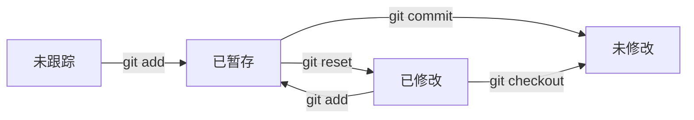

# git

## 初始化

将当前目录初始化为 git 仓库。

```bash
git init [-b <name_of_branch>]
```

设置用户名称、邮箱以及默认分支名称。

```bash
git config --global user.email "<email_address>"
git config --global user.name "<name>"
git config --global init.defaultbranch main
```

## 工作区和文件状态

### 工作区

通过 `git ls-files` 查看暂存区内容。


### 文件的状态

通过 `git status` 查看。



## 提交记录与版本回滚

`git log` 查看历史提交记录

`git reset` 回退版本

| 选项  | 工作区    | 暂存区    |
| -----     | -----     | -----     |
| --soft    | 保留  | 保留  |
| --hard    | 删除  | 删除  |
| --mixed   | 保留  | 删除  |

## 查看区别

`git diff [file_name]$` 对比工作区和暂存区，加上文件名只对比某个文件

`git diff HEAD` 对比工作区和仓库

`git diff --cached` 对比暂存区和仓库

`git diff <old_version_id> <new_version_id>` 对比两个版本

`HEAD` 代表当前版本号；`HEAD~` 代表上个版本号

## 删除文件

`git rm <file_name>` 同时在暂存区和工作区删除文件，然后 `git commit` 执行删除

`git rm --cached <file_name>` 删除仓库中的文件，工作区和暂存区保留

## 忽略文件

在工作区目录下的 `.gitignore` 文件列出需要 git 忽略的文件名称，一经修改便生效

如果文件已经出现在仓库中，`.gitignore` 对其失效，git 仍然会追踪它

## 克隆远程仓库到本地

只介绍 SSH 方式。

在家目录的 `~/.ssh/` 目录下使用 `ssh-keygen` 命令生成密钥。

```bash
ssh-keygen -t rsa -b 4096
# rsa 协议；长度为 4096
```

会在该目录下生成 `id_rsa` 和 `id_rsa.pub` 文件。（或者其它自定义的名称）

复制 `.pub` 文件的内容，在
[Github 设置菜单](https://github.com/settings/keys)
中添加新的 SSH 公钥。

在 `~/.ssh/config` 文件中写入：（假设私钥名为 `test`）

```txt
# github
Host github.com
HostName github.com
PreferredAutentications publickey
IdentifyFile ~/.ssh/test
```

使用 `git clone git@github.com:<username>/<reponame>.git` 将目标仓库克隆到本地。

## 上传本地仓库到 github.com

首先需要在 Github 上建立一个空的远程仓库。

在工作区使用
`git remote add origin git@github.com:<username>/<reponame>.git`
命令关联本地仓库和远程仓库。上例以 `origin` 为分支名称。

在工作目录中执行 `git push` 命令将本地仓库的内容推送到远程仓库。

## 分支

分支的意义在于对正在开发中的项目保持一个可以使用的主要版本，同时使多个开发人员同时专注对项目不同方面的修改。

`git branch` 命令查看所有分支。

`git branch <branch_name>` 创建一个新的分支。

`git switch <branch_name>` 切换到对应分支。

在分支中进行文件的修改、添加和删除对另一个分支没有任何影响。

使用 `git log --graph --oneline --decorate --all`

在 `dev` 分支的开发工作结束后，将分支中的内容合并到 `main` 分支中，需要先切换到 `main` 分支，然后执行：

`git merge dev`

对于完成合并的分支，使用 `git branch -d <branch_name>` 删除。
对于未合并的分支，使用 `git branch -D <branch_name>` 删除。

当分支中存在同一个文件被修改，分支发生冲突，合并失败。

执行 `git merge --abort` 以放弃合并。

使用 `git status` 查看冲突的内容，并修改对应的文件。

结束之后进行 `git commit` 完成冲突的解决，合并成功。
